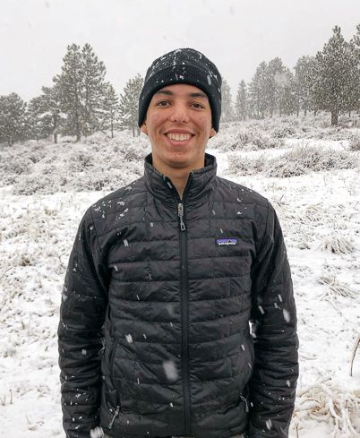
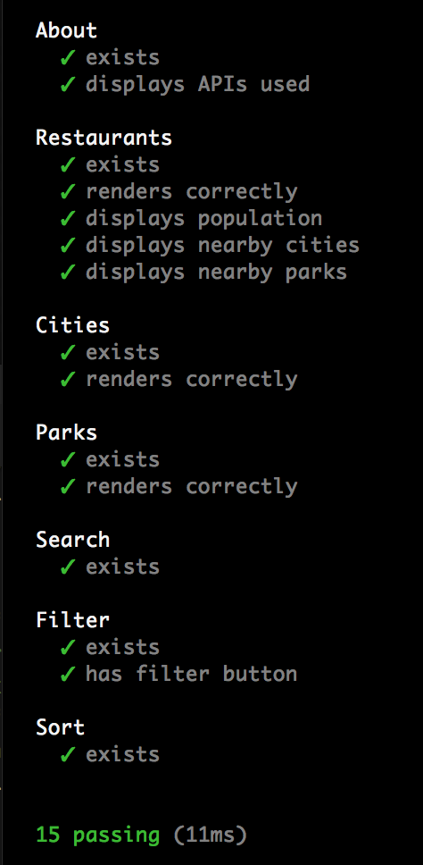
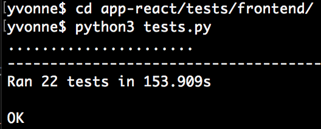
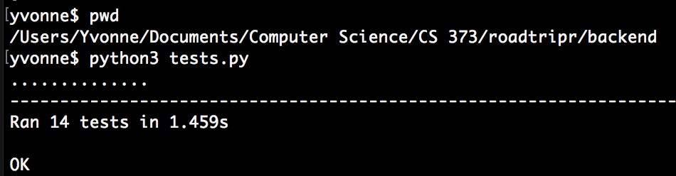

# Roadtripr

Discover the freedom of the open road

---

## Are We There Yet?

---

## Jonathan Brewer

-  API, UML, Routing, Testing 

---

## Matthew Savignano

- Server, AWS, React, Searching, Filtering 

--- 

## Jose Magana

- Server, API, Searching, Sorting, Styling 

---
## Yvonne Huang

 - React, Filtering, Testing, Styling 

---

## Unit Tests

### Frontend

---

### GUI

---

### Backend

---

# Self-Critique

--- 

## What did we do well? 

- Site is easy to navigate and consistent in style |
- Navigation bar is visually appealing along with search bar |
- Our API is easy to use |
- Search highlighting and other React components work well |

---

## What did we learn?

- AWS and server procedures along with Bootstrap and React components  |
- Setting up API |
- Seperate frontend and backend and communicate between the two |
- Learned how to design the site using various styling attributes |

---

## What can we do better?
- Overall code quality and could have created branches to avoid merge conflicts |
- Created a loading visual and displayed more data for model pages |
- Cross-browser compatibility  |
- More efficient search calls |

---

## What puzzles us?
- Rendering elements across different browsers |
- Loading too many images on our site returns junk data |

---

## Other critique:
## PocketChef

---

## What did they do well?

- Website is easy to understand |
- Their details page for 'Restaurants' and 'Recipes' display a lot of information |
- Able to filter automatically once a filter is selected  |

---

## What did we learn from their website?

- Their navigation bar is clearly shown which reminded us to look more thoroughly into our site design |
- Image resizing for model display pages  |

---

## What can they do better?

- Their search functionality could be improved |
- More consistency in grid card display across website |
- Ingredients could be filtered by more attributes |

---

## What puzzles us about their website?

- They provided a map for Restaurants details pages but it doesn't display any location |

--- 

## VISUALIZATION

